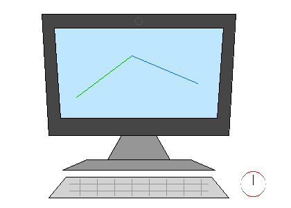

# Computación Gráfica: algoritmos de rasterización

Ejercicios en Python para dibujar primitivas gráficas sobre una matriz de píxeles y exportar los resultados como imágenes. El trabajo recorre algoritmos clásicos de trazado y relleno, aplicados luego a una ilustración construida con esas primitivas.



## Qué implementa

- Trazado de líneas mediante interpolación incremental y el algoritmo de Bresenham.
- Trazado de circunferencias mediante su ecuación y el algoritmo del punto medio.
- Relleno de polígonos con *scanline* y tabla de bordes activos.
- Un lienzo de píxeles y exportación de imágenes PNG con Pillow.

El ejemplo principal combina líneas, circunferencias y polígonos para dibujar una computadora. El código está en [`tp1/`](tp1/); [`main.py`](tp1/main.py) genera las imágenes de demostración.

## Ejecutarlo

Requiere Python 3 y Pillow:

```bash
python -m pip install Pillow
cd tp1
python main.py
```

Las imágenes generadas se guardan en `tp1/`. Es un trabajo académico centrado en los algoritmos de rasterización, no una biblioteca gráfica publicada.
